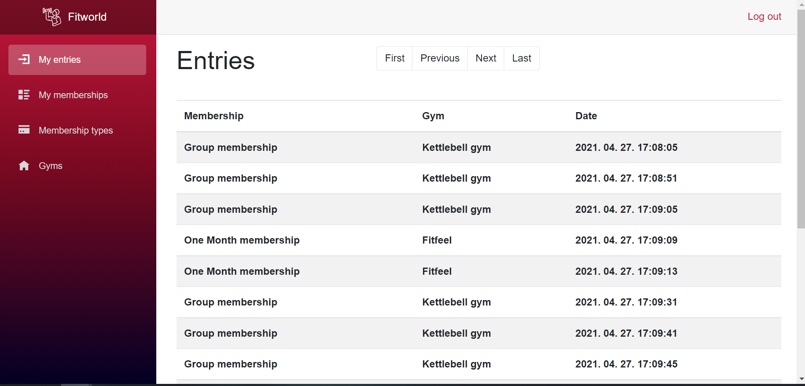

# University project: Fitworld - web application for gym admins and clients

This is a web application written in C# (Blazor) where gym admins can manage gyms/memberships/clients/entries and clients can track their memberships and entries.

## About the project

* The UI is built on Blazor components
* The application uses a local mssql database
* There are two types of users: admins and clients

## Pages:

### Login page

Here the users can log in to their account, this page is the same for the admin and the client.

### Client entry page

Here the admin can entry the client with the client's barcode. First the admin have to choose between one of the client's memberships. If there is none, the admin can create one.

### Entries page

Here the admin can see all client's entries, and the client user can see his/her recent entries.

<table>
  <tr>
    <td>Admin</td>
     <td>Client</td>
  </tr>
  <tr>
    <td></td>
    <td></td>
  </tr>
 </table>
 
 ### Gyms pages
 
 Here the admin and the clients can see the gyms, the admin can add and delete gyms.
 
 <table>
  <tr>
    <td>Admin</td>
     <td>Client</td>
  </tr>
  <tr>
    <td></td>
    <td></td>
  </tr>
 </table>
 
 Here the admin can create a gym.
 
 

 ### Client pages
 
 In these pages the admin can see all clients and create/update/delete them.
 
  <table>
  <tr>
    <td>Clients page (admin)</td>
     <td>Add client</td>
  </tr>
  <tr>
    <td></td>
    <td></td>
  </tr>
 </table>
 
  <table>
  <tr>
    <td>Update client</td>
     <td>Delete client</td>
  </tr>
  <tr>
    <td></td>
    <td></td>
  </tr>
 </table>

### Membership types pages

Here the admin the clients can see all the available membership types that all gyms have. The admin can create and deactivate them.

<table>
  <tr>
    <td>Admin</td>
     <td>Client</td>
  </tr>
  <tr>
    <td></td>
    <td></td>
  </tr>
 </table>
 
  Here the admin can create a membership type.
 
 
 
 ### Client's memberships page
 
 Here the admin can see all client's memberships, and the client user can see the memberships that he/she has.
 
 <table>
  <tr>
    <td>Admin</td>
     <td>Client</td>
  </tr>
  <tr>
    <td></td>
    <td></td>
  </tr>
 </table>
